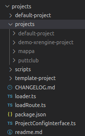
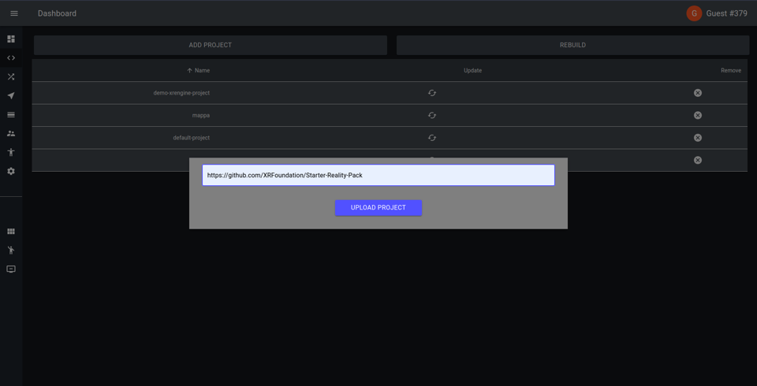
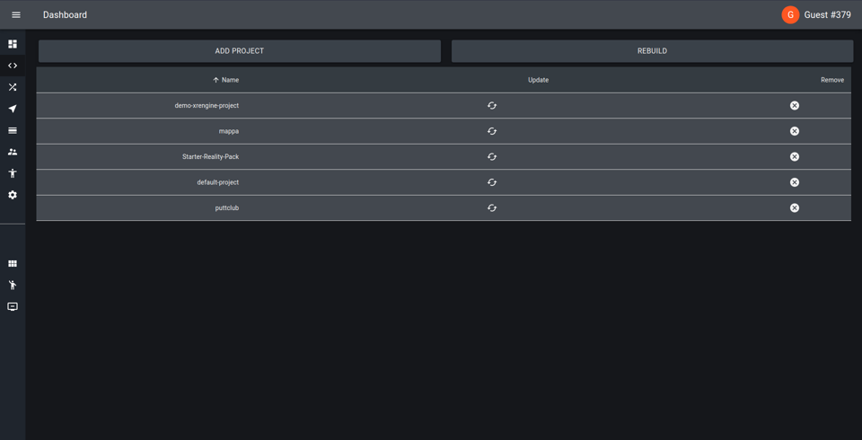

# Projects

Projects are folders that contain all your custom code, assets and scenes. They are version controlled using git & github, and can be installed to any deployment with a single click. (more on that in the [next chapter](./04-editor-scenes-locations.md))

Pictured below is an example of 4 projects installed. By default, only the 'default-project' is installed, which in a production environment is read only. You can find the default project under `/packages/projects/default-project/`



## Configuration

Projects have a few conventions.

- `assets/` is where files uploaded from the editor will be uploaded to

- `public/` is for hosting public assets, these will be served from the client 

- `sceneName.scene.json` is a scene file

- `sceneName.thumbnail.png` is an auto-generated scene thumbmail file

- `xrengine.config.ts` the project configuration, where client routes, database models, feathers services and the project thumbnail can be defined

A project can also have a package.json to provide custom dependencies. @xrengine/* monorepo dependencies will be symlinked and not needed, but some package managers (such as pnpm) requrie these to be defined. If so, they should be defined in `peerDependencies`.

## Local Install Flow

To install a project locally, clone the respository you wish to install to the `/packages/projects/projects/` folder. You can do this with the follow commands:

```
cd packages/projects/projects/
git clone https://github.com/myorg/myrepo
cd myrepo 
code .
```

This will create a folder name `myrepo` which must contain an `xrengine.config.ts` file, and open the project in a new vscode window (such that git commands can be handle by the new window). All you need to do now to run this project is re-run the stack (with `npm run dev`).


## Graphical Install Flow

Projects can also be installed and managed from the /admin/projects route. Click the 'Add Project' 





This runs `git clone` in the background, same as above, but will then upload all of the repository's files to the storage provider. These files will then be downloaded and installed to the local file system each time the docker builder pod runs. This allows full version controlled access for local development flow and version locking for production deployment.

The update button will re-download the git repository to install the latest version of the project.

The remove button will remove the folder containing that project. WARNING: Any uncommitted & unpushed files will be lost.

